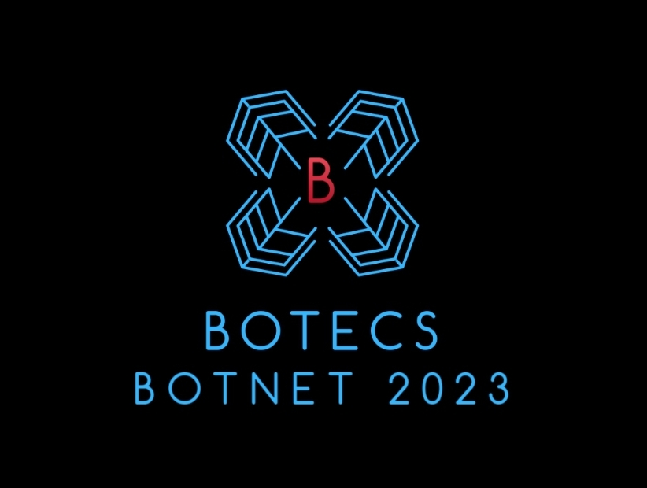
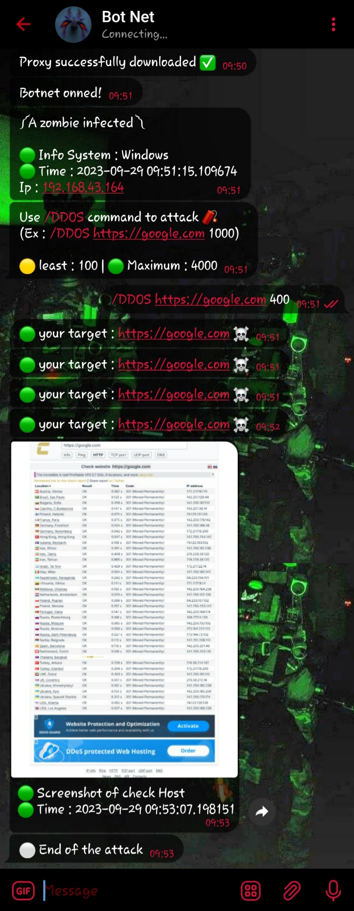

# BotEcs

## Brief explanation 
- Botnet connected to Telegram bot for DDOS attacks
- With this tool, you can hunt and attack Windows and Linux bots

## ScreenShot Bot

 

## Required libraries 
---------------------------------
- pyuseragents
- win32gui
- win32con
- telfhk0
- requests
---------------------------------

## Support from 
- Linux ✅
- Windows [
  7 ✅
  8 ✅
  10 ✅
  ]
- Android ✅

## Description 

`Download the tool, then open the botnet file and enter the Telegram bot token in line 7, then in line 8 enter the numerical ID of the account/group/channel so that it is activated there. 
Botnet is upgradeable and you can upgrade it and make it available to people`

<a href="https://t.me/KnightGuardian59"> join Telegram channel to buy tools</a>

Good luck 
